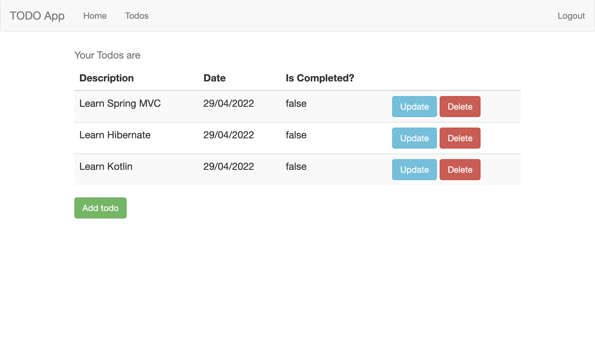

# Spring MVC TODO app
A simple todo web application created with Java and Spring MVC

This application does not use any DB for simplicity so all data is hardcoded. 
You can run it with
```shell
mvn tomcat7:run
```
Application will be available at `localhost:8080`

You can login with the next credentials
```shell
username: test
password: test
```

